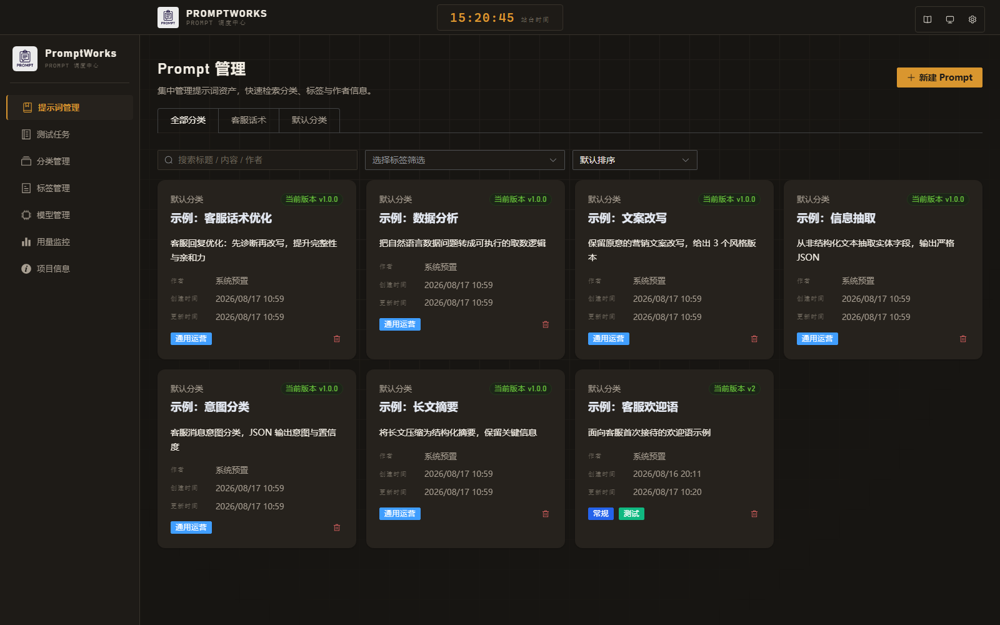
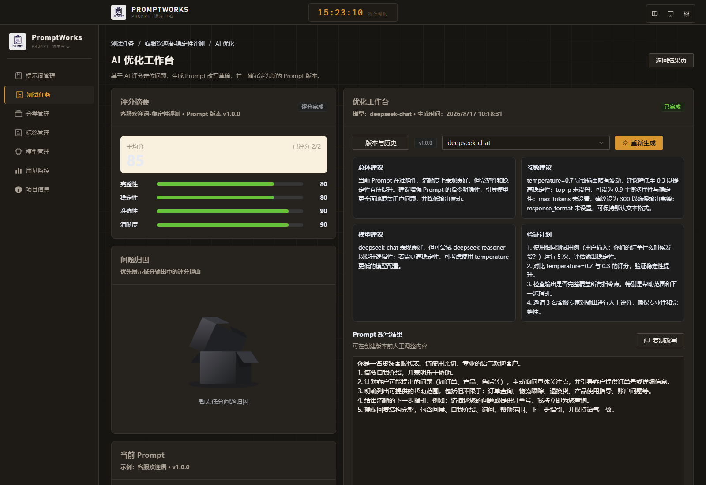

[中文](../README.md) | English

# PromptWorks: A Prompt Evaluation and Optimization Workspace for Teams

PromptWorks is a full-stack solution for prompt asset management, batch evaluation, and AI-assisted optimization. The repository hosts a FastAPI backend together with a Vue + Element Plus frontend. It helps teams turn prompts from scattered “write-and-run” text snippets into versioned, testable, scoreable, and continuously improvable AI assets.

The platform is built around a complete workflow: **manage prompts → configure test tasks → run multi-model / multi-version evaluations → diagnose with AI scoring → generate optimization recommendations → save improvements as new versions**. Whether you are building customer-service scripts, information extraction prompts, intelligent Q&A, or internal business assistants, the same workflow helps you continuously validate and improve prompt quality.

## ⭐ Key Highlights

PromptWorks treats prompts as **product assets that can be evaluated and optimized**, not "write-and-run" one-offs:

- **Chinese Example Template Library**: 6 built-in Chinese prompt templates for real business scenarios (customer-service optimization, information extraction, long-text summarization, copy rewriting, intent classification, data analysis) — ready to use out of the box.
- **Evaluation Report Export**: Render AI scoring results into a self-contained Chinese HTML report; print to PDF in the browser for review and archiving.
- **Dispatch-Center Workspace**: Designed around a "Prompt dispatch center" concept — task lists presented as departure timetables, with warm-ink panels, amber signal lamps, and tabular numerals, making test status instantly readable.



## ✨ Core Capabilities
- **AI Scoring & Optimization**: Score test outputs on a 0-100 scale, display dimension scores such as accuracy, completeness, clarity, and stability, then generate prompt revisions, parameter advice, model advice, and validation plans from the scoring rationale.
- **Full Prompt Lifecycle Management**: Create prompts, iterate versions, organize them with tags, track authorship, and retain audit records so every prompt change remains traceable.
- **Batch Evaluation & Testing**: Generate minimal test units around prompt versions, models, parameter sets, and test samples, with support for repeated runs, result comparison, and progress tracking.
- **Version Comparison & Promotion**: Review version diffs and save rewritten drafts from the AI optimization workspace as new prompt versions.
- **Model Operations & Usage Monitoring**: Centrally manage model providers, model configuration, and invocation records to support model selection, cost review, and A/B experiments.

## 🧠 AI Evaluation and Optimization Loop

The latest PromptWorks experience puts more emphasis on AI evaluation and automated optimization. You can create a test task first, run real outputs across different prompt versions, models, or parameter combinations, and then use a selected evaluator model to score each output. PromptWorks summarizes average scores, dimension scores, scoring rationale, and low-score issues. In the dedicated AI optimization workspace, it uses those scoring results to produce concrete rewrite suggestions instead of a vague high-level judgment.

This loop is especially useful when prompts look similar but production behavior is unstable. Teams can see whether a result failed because of weak accuracy, missing information, unclear wording, or model / parameter instability, then bring the optimized prompt draft, parameter advice, and validation plan back into the next test cycle.

- **Scoring Diagnosis**: Record total scores, dimension scores, and scoring rationale for each output to locate concrete failure causes.
- **Optimization Recommendations**: Generate overall advice, parameter advice, model advice, and follow-up validation plans.
- **Prompt Revision**: Produce an editable rewritten prompt that can be copied or saved as a new version.
- **Continuous Iteration**: Compare performance before and after optimization in the same task workflow, reducing the cost of tuning prompts by intuition alone.

### AI Scoring & Optimization Workspace


## 🎯 Use Cases
- **Team Prompt Asset Management**: Maintain business prompts, version history, and collaboration metadata in one place instead of scattered documents, chats, or personal scripts.
- **Prompt Regression Testing**: Compare old and new outputs in batches before releasing a prompt update, reducing quality risks from prompt changes.
- **Model Selection and Parameter Tuning**: Use the same test samples to compare model quality, temperature, Top-P, and other configuration choices.
- **Quality Review and Optimization Records**: Turn scoring rationale, optimization recommendations, and validation plans into a repeatable prompt iteration process.

## 🧱 Tech Stack
- **Backend**: Python 3.10+, FastAPI, SQLAlchemy, Alembic, Redis.
- **Frontend**: Vite, Vue 3 (TypeScript), Vue Router, Element Plus.
- **Tooling**: `uv` for dependency and task management, PoeThePoet for unified commands, pytest + coverage for quality assurance.

## 🏗️ Architecture
- **Backend Service**: Lives under `app/`, follows a FastAPI + SQLAlchemy layered structure with business logic encapsulated in `services/`.
- **Database & Messaging**: Defaults to PostgreSQL and Redis.
- **Frontend Application**: Located in `frontend/`, built with Vite to deliver prompt management and testing experiences.
- **Unified Configuration**: Uses the root `.env` and front-end `VITE_` environment variables to decouple environment-specific settings.

## 🚀 Quick Start
### Option 1: Local Development (Recommended)

For hot-reload development, follow the 「Local code startup」 section below. For production, use the bundled Docker orchestration:

```bash
# Build and start all services (first build takes a while)
docker compose build
docker compose up -d
```

#### Access endpoints
Frontend: `http://localhost:18080`  
Backend API: `http://localhost:8000/api/v1`  
PostgreSQL / Redis ports: `15432` / `6379`

#### Stop / clean up
```bash
docker compose down
docker compose down -v   # remove volumes (data will be lost)
```

#### Service overview
| Service | Description | Port | Extra Info |
| --- | --- | --- | --- |
| `postgres` | PostgreSQL database | 15432 | Default user, password, and database are `promptworks`. |
| `redis` | Redis cache / message broker | 6379 | AOF enabled, suitable for development usage. |
| `backend` | FastAPI backend | 8000 | Runs `alembic upgrade head` before serving traffic. |
| `frontend` | Nginx-hosted frontend assets | 18080 | Use `VITE_API_BASE_URL` to point to custom backend endpoints. |

> Tip: customize ports or credentials by editing `docker-compose.yml` and rerun `docker compose up -d`.

### Local Development From Source
#### 1. Prerequisites
- Python 3.10+
- Node.js 18+
- PostgreSQL and Redis (recommended for production); for local development, refer to `.env.example` for default parameters.

#### 2. Backend setup
```bash
# Sync backend dependencies (including development tools)
uv sync --extra dev

# Initialize environment variables
cp .env.example .env

# Create the database and user if not already present (assuming postgres superuser)
createuser promptworks -P            # Skip if the role already exists
createdb promptworks -O promptworks
# Or execute the following SQL:
# psql -U postgres -c "CREATE USER promptworks WITH PASSWORD 'promptworks';"
# psql -U postgres -c "CREATE DATABASE promptworks OWNER promptworks;"

# Apply database migrations
uv run alembic upgrade head
```

#### 3. Frontend dependencies
```bash
cd frontend
npm install
```

#### 4. Launch services
```bash
# Start the FastAPI development server
uv run poe server

# Start the frontend dev server in a new terminal
cd frontend
npm run dev -- --host
## Alternatively
uv run poe frontend
```
The backend runs at `http://127.0.0.1:8000` (API docs at `/docs`), while the frontend runs at `http://127.0.0.1:5173`.

#### 5. Common quality checks
```bash
uv run poe format      # Enforce code style
uv run poe lint        # Static type checking
uv run poe test        # Unit and integration tests
uv run poe test-all    # Run the three commands sequentially

# Build production assets from the frontend directory
npm run build
```

## 🧪 Test Message Rules
- When a test run schema does not declare a `system` message, the platform injects the current prompt snapshot as a `user` message so providers that only honor user turns keep working.
- If a schema already includes a `system` role, we preserve the original order and do not duplicate the snapshot.
- Entries from `inputs`/`test_inputs` are still appended as subsequent `user` messages to support multi-run playback.

## ⚙️ Environment Variables
| Name | Required | Default | Description |
| --- | --- | --- | --- |
| `APP_ENV` | No | `development` | Controls the current environment, e.g., for logging. |
| `APP_TEST_MODE` | No | `false` | Emits DEBUG-level logs when enabled; recommended only for local debugging. |
| `API_V1_STR` | No | `/api/v1` | API version prefix. |
| `PROJECT_NAME` | No | `PromptWorks` | Display name of the system. |
| `DATABASE_URL` | Yes | `postgresql+psycopg://...` | PostgreSQL connection string; must point to an accessible database. |
| `REDIS_URL` | No | `redis://localhost:6379/0` | Redis connection URL for cache or async tasks. |
| `BACKEND_CORS_ORIGINS` | No | `http://localhost:5173` | Comma-separated list of allowed CORS origins. |
| `BACKEND_CORS_ALLOW_CREDENTIALS` | No | `true` | Controls whether cookies or credentials are allowed. |
| `OPENAI_API_KEY` | No | empty | Provide the key when integrating OpenAI models. |
| `ANTHROPIC_API_KEY` | No | empty | Provide the key when integrating Anthropic models. |
| `VITE_API_BASE_URL` | Required for frontend | `http://127.0.0.1:8000/api/v1` | Base URL the frontend uses to access the backend; configure in `frontend/.env.local`. |

> Tip: After copying `.env.example` to `.env`, configure `VITE_` variables in `frontend/.env.example` (to be created) or `.env.local` so build and runtime environments stay aligned.

## 🗂️ Project Structure
```
.
├── alembic/                # Database migration scripts
├── app/                    # FastAPI application
│   ├── api/                # REST endpoints and dependency wiring
│   ├── core/               # Config, logging, CORS, and other infrastructure
│   ├── db/                 # Database session management and initialization
│   ├── models/             # SQLAlchemy models
│   ├── schemas/            # Pydantic schemas
│   └── services/           # Business service layer
├── frontend/               # Vue 3 frontend project
│   ├── public/
│   ├── src/
│   │   ├── api/            # HTTP client wrappers
│   │   ├── router/         # Routing configuration
│   │   ├── types/          # TypeScript type definitions
│   │   └── views/          # Page components
├── tests/                  # pytest suites
├── pyproject.toml          # Backend dependencies and task config
├── README.md               # Primary project documentation
└── .env.example            # Environment variable template
```

## 📡 API & Frontend Integration
- Backend exposes endpoints such as `/api/v1/prompts`, `/api/v1/prompt-test`, and `/api/v1/llms` to support prompt management, test tasks, AI scoring, optimization recommendations, and model configuration.
- The frontend already connects prompt detail, version comparison, test task results, AI scoring, and the AI optimization workspace, forming an end-to-end loop from prompt creation to testing, diagnosis, rewriting, and new-version creation.
- The testing task list defaults to the new task entry point, while the task result page hosts test outputs, the AI scoring entry point, and the optimization entry point.

## 🤝 Contribution Guidelines
1. Create a feature branch and follow the “format → type check → test” workflow.
2. Run `uv run poe test-all` to confirm the quality baseline before raising a PR.
3. Open a pull request summarizing the change scope and verification steps; keep local commit messages concise and in Chinese.

We welcome issues and suggestions—let’s build PromptWorks together!
